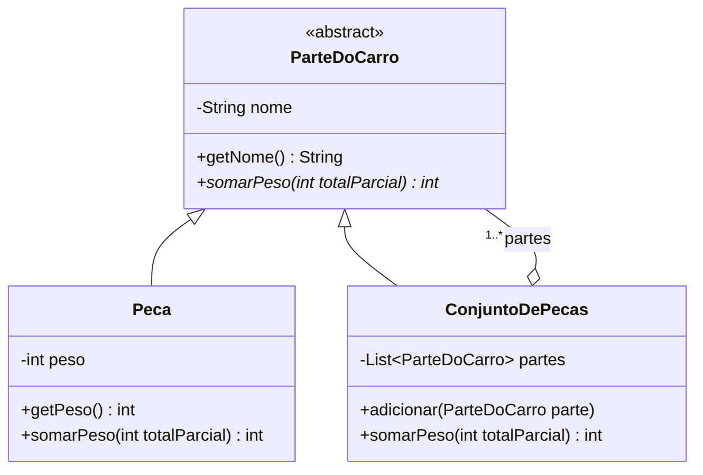

# Padrão Composite — Peso de um carro

Lista Avaliativa I — Padrões de Projetos Orientados a Objetos.

## Enunciado (resumo)
- Carro = carroceria + chassi.
- Carroceria = para-lamas, portas, painéis, porta-malas e capô.
- Chassi = trem de força + suspensão.
- Trem de força = motor, transmissão, diferencial e rodas.
- Toda parte tem **nome** e **peso**.

Tarefa: usando **Composite**, desenhar um diagrama de classes e codificar um programa que calcula o peso
total do carro. Sempre que o peso de uma parte for contabilizado, imprimir:

```
Somando agora o peso de NOME_DA_PARTE: PESO_DA_PARTE. Total parcial: SOMA_PARCIAL
```

## Diagrama de classes
Fonte em [`docs/diagrama.mmd`](docs/diagrama.mmd); árvore do carro em [`docs/arvore.md`](docs/arvore.md).



| Papel no Composite | Classe |
|---|---|
| Componente | `ParteDoCarro` |
| Folha | `Peca` (para-lamas, portas, motor, rodas...) |
| Composto | `ConjuntoDePecas` (carro, carroceria, chassi, trem de força) |
| Operação comum | `somarPeso(int totalParcial)` |

## Como funciona
O `Main` chama `carro.somarPeso(0)` só na raiz. Cada `ConjuntoDePecas` repassa o total acumulado para os
seus filhos, sem saber se são peças ou outros conjuntos; cada `Peca` soma o seu peso, imprime a mensagem e
devolve o novo total. Assim o cliente trata uma peça e o carro inteiro da mesma forma.

## Como executar (a partir da raiz do repositório)

```bash
javac -encoding UTF-8 -d out carro/*.java
java -cp out Main
```

Saída:

```
Somando agora o peso de Para-lamas: 20. Total parcial: 20
Somando agora o peso de Portas: 100. Total parcial: 120
Somando agora o peso de Painéis: 60. Total parcial: 180
Somando agora o peso de Porta-malas: 25. Total parcial: 205
Somando agora o peso de Capô: 20. Total parcial: 225
Somando agora o peso de Motor: 180. Total parcial: 405
Somando agora o peso de Transmissão: 90. Total parcial: 495
Somando agora o peso de Diferencial: 40. Total parcial: 535
Somando agora o peso de Rodas: 100. Total parcial: 635
Somando agora o peso de Suspensão: 80. Total parcial: 715
Peso total do carro: 715 kg
```

> No Windows, se os acentos aparecerem trocados no terminal, rode `chcp 65001` antes ou use
> `java -Dstdout.encoding=UTF-8 -cp out Main`.

## Uso de IA
Prompts, tutorial e ajustes estão em [PROMPTS.md](PROMPTS.md). A evolução da solução pode ser lida no
histórico de commits: um commit por passo do tutorial + um commit por ajuste.
